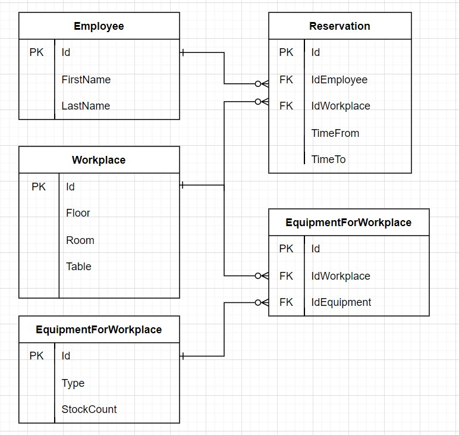

# WorkplaceMG

WorkplaceMG is an application, on which you can make a reservation for a place in office.

## Installation
1.Change your connection string in appsettings.json

```bash
"ConnectionStrings": {
    "WorkplaceConnectionString": "Server=.;Database=WorkplaceDb;Trusted_Connection=True;"
  },
```
2. Initiate database

Run `update-database` command in Package Manager Console.

## Database diagram




## Architecture

This is a web application, which uses Model-View-Controller (MVC) design patter.

Model part is supported by repository-service pattern, which contains businness logic with operations that should be performed by it.

Repository-Service pattern divides the business layer into two semi-layers. Repository handles getting data into and out of database.

Service is responsible for operations on data and passing them between repository and controller.

## About

Solbeg 3rd Task